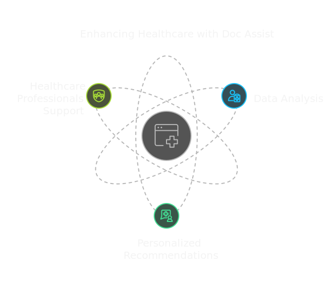

# DocAssist: Intelligent Medical Decision Support System

<div align="center">
  
  <br>
  <p><i>Empowering Healthcare Decisions with AI</i></p>
</div>

[](https://github.com/realranjan/DOCASSIST-AI)
[](https://github.com/realranjan/DOCASSIST-AI)
[](https://opensource.org/licenses/MIT)

## Related Repositories

##  🎨 **[UI Repository]** : (https://github.com/realranjan/DOCASSIST-AI) - Frontend implementation


## Problem Statement
In the current medical landscape, doctors face significant challenges in processing vast amounts of patient data to make treatment decisions. This can lead to:
- Delays in treatment decisions
- Inconsistencies in recommendations
- Suboptimal treatment choices
- Increased cognitive load on healthcare providers

DocAssist addresses these challenges by providing an AI-powered decision support tool that assists healthcare professionals in making informed, data-driven clinical decisions.

## System Architecture
<div align="center">
  
  <br>
  <p><i>DocAssist AI System Architecture: Integrating Healthcare Support, Data Analysis, and Personalized Recommendations</i></p>
</div>

## Web Interface
The system features a modern, intuitive web interface built with:
- **Frontend**: Next.js, Tailwind CSS, shadcn/ui components
- **Backend**: Flask API server
- **Deployment**: Vercel (Frontend), Render (Backend)


### Key UI Features
- 📊 Interactive dashboards for data visualization
- 📱 Responsive design for all devices
- 🔄 Real-time analysis updates
- 📄 PDF report generation and viewing
- 🎨 Modern and clean user interface
- 🔒 Secure data handling

## Dataset Information
The dataset is sourced from a private hospital in Indonesia and contains comprehensive patient laboratory test results used for treatment recommendations.

### Features
| Feature Name  | Data Type    | Description |
|--------------|--------------|-------------|
| HAEMATOCRIT  | Continuous   | Proportion of blood volume occupied by red blood cells |
| HAEMOGLOBINS | Continuous   | Oxygen-carrying protein in red blood cells |
| ERYTHROCYTE  | Continuous   | Red blood cell count per volume |
| LEUCOCYTE    | Continuous   | White blood cell count per volume |
| THROMBOCYTE  | Continuous   | Platelet count per volume |
| MCH          | Continuous   | Mean Corpuscular Hemoglobin |
| MCHC         | Continuous   | Mean Corpuscular Hemoglobin Concentration |
| MCV          | Continuous   | Mean Corpuscular Volume |
| AGE          | Continuous   | Patient age |
| SEX          | Nominal      | Patient gender (M/F) |
| SOURCE       | Nominal      | Patient care type (1 = In-care, 0 = Out-care) |

## Project Structure
```
DOCASSIST-MODEL/
├── data/                  # Dataset files
├── models/             # model files
├── notebooks/            # notebook
└── visuals/              # Project diagrams
```

## Technical Implementation

### Data Preprocessing
1. **Data Cleaning**
   - Handling missing values
   - Removing duplicate entries
   - Outlier detection and treatment

2. **Feature Engineering**
   - Creation of derived features (e.g., thrombocyte-leucocyte ratio)
   - Encoding of categorical variables
   - Scaling numerical features using RobustScaler

3. **Exploratory Data Analysis**
   - Distribution analysis of class labels
   - Gender and age demographics
   - Feature correlation analysis
   - Statistical visualization of numerical features

### Model Performance

#### Pre-tuning Performance
| Model                  | Train Accuracy | Test Accuracy | ROC AUC | Precision |
|-----------------------|----------------|---------------|---------|-----------|
| Random Forest         | 100.00%        | 75.88%       | 0.80    | 0.74      |
| CatBoost             | 87.19%         | 75.31%       | 0.82    | 0.73      |
| LightGBM             | 92.94%         | 74.52%       | 0.81    | 0.71      |
| XGBoost              | 98.67%         | 74.41%       | 0.81    | 0.70      |
| AdaBoost             | 75.57%         | 74.07%       | 0.79    | 0.72      |
| Support Vector Machine| 76.79%         | 73.61%       | 0.79    | 0.74      |
| K-Nearest Neighbors   | 80.31%         | 72.03%       | 0.75    | 0.67      |
| Logistic Regression   | 72.83%         | 71.46%       | 0.75    | 0.70      |

#### Post-tuning Performance
| Model              | Train Accuracy | Test Accuracy | ROC AUC | Precision |
|-------------------|----------------|---------------|---------|-----------|
| Tuned XGBoost     | 96.57%        | 77.12%       | 0.81    | 0.76      |
| Tuned Random Forest| 91.67%        | 76.67%       | 0.81    | 0.76      |
| Tuned CatBoost    | 91.47%        | 76.67%       | 0.81    | 0.74      |
| Tuned LightGBM    | 88.18%        | 77.34%       | 0.82    | 0.75      |

### Key Findings
- **Optimal Model Selection**: LightGBM achieved the highest test accuracy (77.34%) after tuning
- **Reduced Overfitting**: Training accuracy decreased while test accuracy increased
- **Consistent Performance**: All tuned models showed ROC AUC scores of 0.81
- **High Precision**: XGBoost and Random Forest achieved 0.76 precision after tuning

### Final Model: LightGBM
After comprehensive evaluation and hyperparameter tuning, **LightGBM** was selected as the final production model for the following reasons:

#### Performance Metrics
- **Test Accuracy**: 77.34% (highest among all models)
- **Train Accuracy**: 88.18% (good balance between bias and variance)
- **ROC AUC**: 0.82 (strong classification capability)
- **Precision**: 0.75 (reliable positive predictions)

#### Key Advantages
- **Gradient Boosting Framework**: LightGBM uses a highly efficient gradient boosting framework
- **Leaf-wise Growth**: Employs leaf-wise tree growth strategy for better accuracy
- **Memory Efficient**: Uses histogram-based algorithms to handle categorical features
- **Fast Training**: Significantly faster training speed compared to traditional GBDT
- **Handling Imbalanced Data**: Better performance on slightly imbalanced medical datasets

#### Model Configuration
```python
lightgbm_params = {
    'objective': 'binary',
    'metric': 'binary_logloss',
    'boosting_type': 'gbdt',
    'num_leaves': 31,
    'learning_rate': 0.05,
    'feature_fraction': 0.9
}
```

#### Production Implementation
The model is deployed with:
- Regular retraining pipeline for maintaining accuracy
- Model versioning for tracking performance
- Monitoring system for detecting drift
- Fallback mechanisms for reliable predictions

### Features Available in Demo
- ✅ Blood test report analysis
- ✅ Real-time parameter visualization
- ✅ PDF report generation
- ✅ Treatment recommendations
- ✅ Historical data tracking

## Installation and Setup

### Prerequisites
- Python 3.7+
- pip package manager

### Installation
```bash
# Clone the repository
git clone [https://github.com/realranjan/DOCASSIST-MODEL.git]

# Navigate to project directory
cd docassist
```

### Usage
1. Data Preparation:
```python
# Import required libraries
import pandas as pd
from docassist import preprocess

# Load and preprocess data
data = pd.read_csv('path_to_data.csv')
processed_data = preprocess.prepare_data(data)
```

2. Model Training:
```python
# Import model trainer
from docassist import model

# Train model
trained_model = model.train(processed_data)
```

3. Making Predictions:
```python
# Get predictions
predictions = model.predict(patient_data)
```

## Future Improvements
1. **Data Enhancement**
   - Expand dataset diversity
   - Include additional medical parameters
   - Incorporate temporal patient data

2. **Technical Improvements**
   - Implement deep learning models
   - Develop REST API for model serving
   - Create web-based user interface
   - Add real-time monitoring capabilities

3. **Clinical Integration**
   - Integrate with Electronic Health Records (EHR)
   - Implement HIPAA compliance measures
   - Add support for multiple medical specialties

## Contributing
We welcome contributions to improve DocAssist. Please follow these steps:
1. Fork the repository
2. Create a feature branch (`git checkout -b feature/AmazingFeature`)
3. Commit your changes (`git commit -m 'Add some AmazingFeature'`)
4. Push to the branch (`git push origin feature/AmazingFeature`)
5. Open a Pull Request

## License
This project is licensed under the MIT License - see the [LICENSE](LICENSE) file for details.

## Contact
- **Ranjan Vernekar** - Project Lead
  - LinkedIn: [Ranjan Vernekar](https://www.linkedin.com/in/ranjan-vernekar-a93b08252/)
  - GitHub: [@realranjan](https://github.com/realranjan)

## Acknowledgments
- Private hospital in Indonesia for providing the dataset
- Healthcare professionals who provided domain expertise
- Open-source community for machine learning tools and libraries

---

## 👤 About the Author: Ranjan Vernekar

As the project lead for DocAssist, I spearheaded the end-to-end development and deployment of an AI-powered medical decision support system. My key contributions include:

- **Full-stack Solution Design:**  
  Architected and implemented a robust, modular system integrating a Python-based machine learning backend (LightGBM, XGBoost, CatBoost, etc.) with a modern, responsive Next.js frontend, ensuring seamless user experience for healthcare professionals.

- **Data Engineering & Preprocessing:**  
  Led the data pipeline design, including advanced feature engineering (e.g., thrombocyte-leucocyte ratio), robust handling of missing/duplicate values, and scaling/encoding strategies to optimize model performance on real-world medical datasets.

- **Model Selection & Optimization:**  
  Conducted comprehensive benchmarking of multiple ML algorithms, culminating in the selection and fine-tuning of LightGBM as the final production model, achieving a test accuracy of 77.34%, ROC AUC of 0.82, and precision of 0.75.

- **Production-Ready ML Deployment:**  
  Developed a retrainable, versioned model deployment pipeline with monitoring and fallback mechanisms, ensuring reliability and adaptability in clinical environments.

- **UI/UX Innovation:**  
  Designed and integrated a user-friendly web interface with real-time dashboards, PDF report analysis, and secure data handling, leveraging shadcn/ui and Tailwind CSS for a modern look and feel.

- **Open Source & Documentation:**  
  Authored comprehensive documentation and a visually rich README, including architecture diagrams, UI screenshots, and clear project structure, facilitating community contributions and transparency.

- **Cross-functional Collaboration:**  
  Coordinated with healthcare professionals for domain expertise, and managed open-source contributions, fostering a collaborative and innovative project culture.

- **End-to-End Deployment:**  
  Deployed the solution using Vercel (frontend) and Render (backend), and ensured accessibility via a live demo and public GitHub repositories ([DOCASSIST-AI UI & Backend](https://github.com/realranjan/DOCASSIST-AI), [DOCASSIST-MODEL](https://github.com/realranjan/DOCASSIST-MODEL)).

### Resume-Ready Bullet Points

- Led the design and deployment of DocAssist, an AI-driven medical decision support system, integrating LightGBM for 77.34% test accuracy and 0.82 ROC AUC.
- Architected a scalable, modular ML pipeline with robust data preprocessing, feature engineering, and model versioning for clinical reliability.
- Developed a modern, responsive web UI using Next.js and Tailwind CSS, enabling real-time blood test analysis and PDF report generation.
- Authored comprehensive project documentation, including technical architecture, UI/UX visuals, and open-source guidelines, driving community engagement.
- Deployed full-stack solution to production (Vercel/Render), providing a live demo and public repositories for global accessibility.
- Collaborated with healthcare professionals and open-source contributors to ensure clinical relevance and technical excellence.

---
<div align="center">
  <p>Made with ❤️ by the DocAssist AI Team</p>
  <p>© 2024 DocAssist AI. All rights reserved.</p>
</div> 
